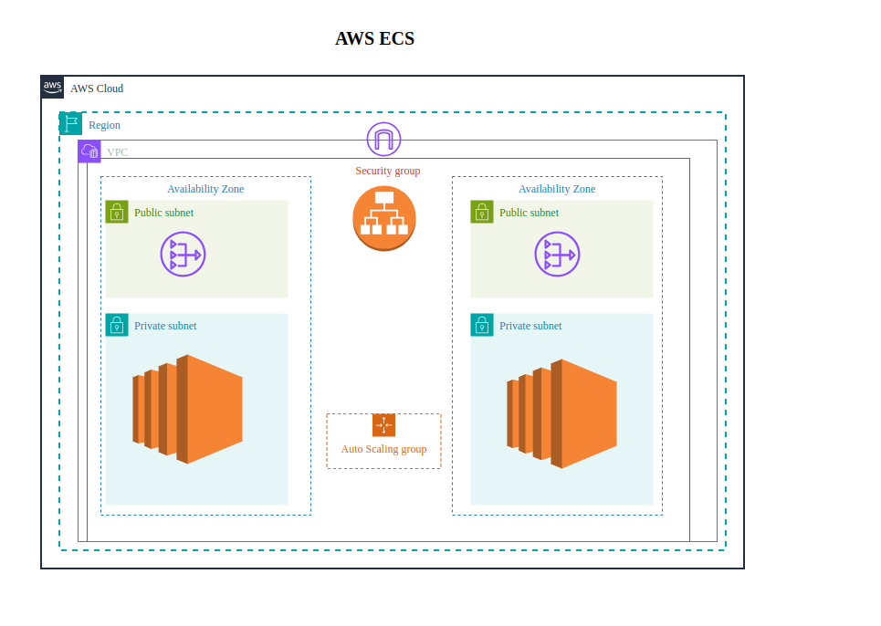
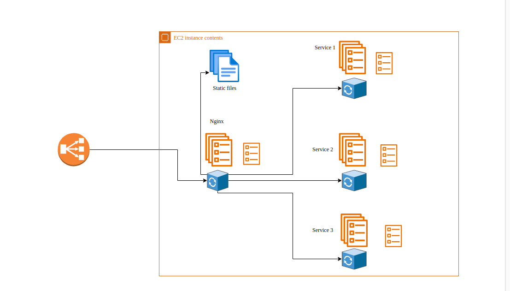

Django project deployment in ECS using terraform

deployment of django with nginx and uWSGI on ECS and EC2 ASG(Autoscaling group)

## CICD
when it comes to CICD, we can use multiple tools like Jenkins, githubactions, AWS CodePipeline ... , 
but here I am using Jenkins, and I think the CodePipeline with Codebuild is more expensive that Jenkins instance. 

## NB
1. using nginx along with alb might not be necessary as alb will handle what nginx does.like ssl/tls termination, loadbalancing, routing....
we can leave it out, but I just used it 😄

2. this is a general implementation that can be used with any techstack not only for django
 

3. here I am using docker images from dockerhub not from ECR, I want to save my ECR free tier for another side projects, 😄

## design

  
<h3>Top View</h3> 

  

    
  

   

  
<h3>Internal view </h3> 

  

## ! Feedback, Comment, Suggestion ...
please feel free to give any thought or suggestion => [https://anonfeedback.vercel.app/feedback/becaa6cd-0154-4363-ad42-b6629951020b](https://anonfeedback.vercel.app/feedback/becaa6cd-0154-4363-ad42-b6629951020b)

- **no login**
- **no signup**
- **just a text box,**

### => It is not finished yet, I will finalize it when I get enough time and coffee !!
